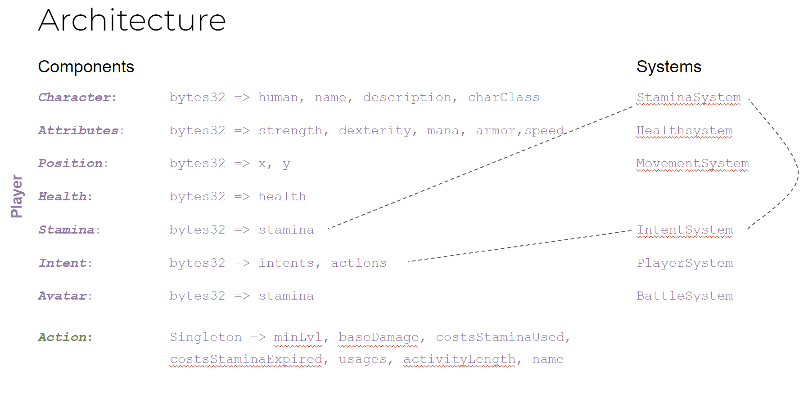

# Swash Buckler
A blockchain-based multiplayer real-time strategy game built for the EthGlobal Autonomous Worlds hackathon.

## Game Rules
* The level is an arena
* Each player controls a character with keyboard input (WASD)
* Each character on the arena has a class (e.g. archer, warrior, etc.)
* A team can have up to 4 players
* At times there is a lootbox in the middle of the arena that can be extracted from the match, if a character is able to reach it and stay alive until reaching the extraction point
* The match ends when all characters of a team are dead or when the lootbox is extracted
* The team that wins the match obtains the arena
* The team that extracts the lootbox obtains the loot
---

## Game Flow
Each round is made up of as many sequences as needed until the winning state has been reached.

A sequence is divided into 3 phases:

**Phase 1:** 
30 sec Battle - Move and attack

**Phase 2:** 
5 sec Aftermath - Move until total depletion of stamina

**Phase 3:** 
Perk Selection - Select a perk to be applied to the character for the next sequence

---

## Game Mechanics
Each character has:
* a health bar and a stamina bar
* a class (e.g. archer, warrior, etc.)
    * that has a set of attributes (e.g. health, stamina)
* a set of stats (e.g. strength, dexterity, etc.)
* a slot for intended action (e.g. attack, move, etc.)
    * use a weapon (e.g. sword, bow)
    * use skills (e.g. shoot, slash)
    * use items (e.g. armor, potions)
    * use buffs (e.g. speed, damage)
    * use debuffs (e.g. slow, damage)
    * use abilities (e.g. dash, counter attack)

Based on these parameters it is up to the player to take strategic decisions based on the remaining stamina and balance his movement and the intended next actions in order to win the match.

---
## Requirements
- node v18.12.0
- pnpm v6.21.1
- Foundry toolkit
- mud v2

## How to run it
- Install dependencies:
    - In project root: `pnpm install` will install all dependencies in project, contracts and client packages

- Run dev environment for mud
    - In project root: `pnpm run dev` will start mud (foundry, vite etc.)

- Run the client and navigate to localhost:3000

## Technical overview

### Overview MUD components & systems

## Current State
- Visualization & Synchronization with other entities (they can be spawned, but they neither visualized nor synchronized the blockchain)
- Proper game loop and battle system
  While the majority of base systems (Intent, health, stamina, Player) are working the crucial battle system is not implemented yet.

- Client
    - Loading and uniform loading of entities, intents
    - Main menue

## Outlook
General goal is to implement a full game, which focuses team play and fun.
The game should be playable in a browser and on mobile devices.

The following features are planned:
- Game
    - Add treasure mechanic

- Battle systems
    - Combos
    - Multiple Intents
    - Experiment with action queue

- Skill system
    - Improve stats
    - Improve and add further actions (e.g. specials)
    - Add further items & weapons

- Business model implementation
    - Ability to set bounties on maps and players
    - Ability to buy items and maps (nfts)
    - Provide a toolkit

## Feedback MUD
- Swagger like UI to test contract calls (systems and models)
- Mongoose Model + Services for components
- Technical Details (standard BC issues)
    - Randomisation
    - Time
    - Ticks (game loop) check for distance…

# Whys
## Why pixi.js
- It's a 2D rendering engine i.e. for gaming. Phaser was in the selection process, but the site is down since 3 weeks.
  Additionally I found the overhead in the template project way too high for my taste as well that we have to stick to react as well.
- It's a low level library, which means that it's not opinionated and you can do whatever you want with it.
- It's a rendering engine, which means that it's not a game engine. This means that we have to implement the game logic ourselves.

# Resources
- pixi.js: https://www.pixijs.com/
  - https://github.com/pixijs/pixijs#readme
  - https://www.pixijselementals.com/

- Assets
  - https://pixabay.com/illustrations/troll-kobold-fantasy-ears-3331618/

